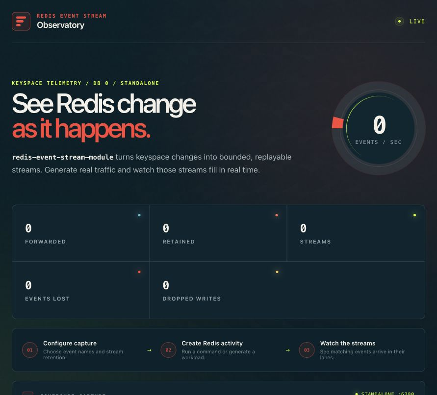

# Redis Event Stream

[](https://github.com/joshrotenberg/redis-event-stream-module/actions/workflows/ci.yml)
[](https://joshrotenberg.github.io/redis-event-stream-module/)
[](https://github.com/joshrotenberg/redis-event-stream-module/releases/latest)
[](#license)


A Redis module that mirrors selected keyspace events into bounded, replayable
Redis Streams.

An expiration, `SET`, `DEL`, or another selected event becomes a stream entry
written atomically with the keyspace change. Applications consume the entries
with ordinary Redis commands such as `XREAD`, `XRANGE`, and `XREADGROUP`.

The project is pre-1.0, with a documented
[stability contract](docs/src/stability.md) for the surfaces intended to
freeze at 1.0. Standalone Redis and replication/failover are the primary
targets; OSS Cluster per-node capture and multi-shard Redis Enterprise are
Preview capabilities.

## Why use it

- **Survive disconnects.** Unlike keyspace pub/sub, entries wait in a stream
  while a consumer is offline.
- **Replay recent history.** Resume from a stream ID or inspect a retained time
  range.
- **Distribute work.** Redis consumer groups provide acknowledgement,
  redelivery, and worker coordination.
- **Detect capture gaps.** Counters and a control stream expose disabled,
  reconfigured, or failed capture.

This is a live mirror, not permanent change data capture, an application
outbox, or a write-ahead log. Retention is bounded, and crash durability is
whatever the Redis persistence configuration provides.

## Try it in 60 seconds

Run the Phoenix LiveView observatory to configure capture, send real Redis
commands, and watch each event type fill its stream in real time.



```bash
docker build \
  -f demos/liveview/Dockerfile \
  -t redis-event-stream-observatory .
docker run --rm -p 4000:4000 redis-event-stream-observatory
```

Open [http://127.0.0.1:4000](http://127.0.0.1:4000), then follow the visible
configure → send commands → watch streams workflow. Standalone mode is the
default; an advanced three-master mode demonstrates cluster routing, per-node
stream discovery, and merged event lanes.

The image is a local evaluation environment, not a production Redis control
plane. See the [observatory guide](docs/src/observatory.md) for architecture,
security boundaries, and source setup. Prefer a command-line walkthrough? See
the [module quickstart](docs/src/quickstart.md).

## How capture is organized

Event names route to one stream each:

| Event | Default destination |
|---|---|
| Key expiration | `events:expired` |
| `SET` | `events:set` |
| `HSET` | `events:hset` |
| `DEL` | `events:del` |

The default configuration captures expirations and retains approximately the
newest 10,000 entries. Runtime configuration can select events, key globs,
source databases, count- or time-based retention, entry shapes, and an optional
combined firehose.

`notify-keyspace-events` does not need to be enabled. That setting controls
Redis pub/sub delivery; module subscribers receive keyspace events
independently.

## Configure the feed

Widen the default expiration-only filter at runtime:

```text
CONFIG SET eventstream.events "expired,set,hset,del"
CONFIG SET eventstream.key-filter "session:*,lease:*"
CONFIG SET eventstream.maxlen 100000
```

The event and key filters are combined, so only named operations affecting a
matching key are mirrored. Retention can be count-based, time-based, or
overridden per event type.

Inspect the effective state after a change:

```text
CONFIG GET eventstream.*
EVENTSTREAM.STATS
EVENTSTREAM.STREAMS VERBOSE
```

These inspection commands are read-only. `EVENTSTREAM.STREAMS VERBOSE` reports
each registered destination, whether it currently exists, and its length. See
[Configure capture](docs/src/configure.md) for filter recipes and the
[configuration reference](docs/src/reference/configuration.md) for exact
defaults and validation.

## Know the boundary

- Capture is at-most-once overall. Events during unloaded, disabled, refused,
  or unpersisted windows cannot be recreated by the module.
- Consumer groups provide at-least-once processing only while entries remain
  inside the retention window.
- Gap markers identify when capture was incomplete, not which keys were
  missed. An expired key is already gone, so exact reconciliation requires an
  independent application index or source of truth.
- Replication and AOF/RDB settings determine crash and failover durability.
- Cluster mode produces node-local tagged streams that consumers must discover
  and merge.

Read [Reliability and delivery](docs/src/reliability.md) before using captured
events for production work.

## Documentation

- [Overview](docs/src/overview.md)
- [Configure capture](docs/src/configure.md)
- [Consume events](docs/src/consume.md)
- [Forward streams to a webhook](docs/src/sink-connector.md)
- [Production checklist](docs/src/production.md)
- [Deployment topologies](docs/src/topologies.md)
- [Configuration reference](docs/src/reference/configuration.md)
- [Commands and observability](docs/src/reference/commands-observability.md)
- [Authoritative specification](SPEC.md)

Runnable consumers are included for
[Python](examples/python),
[Go](examples/go),
[Node.js](examples/node), and
[Rust](crates/eventstream-client). The Rust client includes the first-party
decoder for streams that mix stable fixed entries with Preview `batch-v1`
envelopes.

## Build and contribute

Build the native module with Rust 1.88 or newer:

```bash
cargo build --release
```

The artifact is
`target/release/libredis_event_stream_module.so` on Linux and `.dylib` on
macOS. Prebuilt artifacts, checksums, attestations, the consumer client, and a
Redis Enterprise RAMP bundle are attached to each
[release](https://github.com/joshrotenberg/redis-event-stream-module/releases).

See [CONTRIBUTING.md](CONTRIBUTING.md) for tests and development workflows.
Report security issues through [SECURITY.md](SECURITY.md).

## License

Licensed under either the [Apache License, Version 2.0](LICENSE-APACHE) or the
[MIT license](LICENSE-MIT), at your option.
